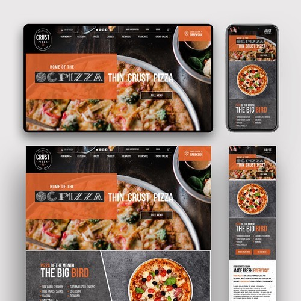

# OCPizza

## About

This is my tenth project for Openclassrooms' **Android App Development program**.

This is the **Documentation** of a management solution to a restaurant-chain, that features a commercial website and a Native Android app.

The solution is thoroughly explained and covers all aspects of functional and technical specifications, ranging from Class Diagrams and Component Diagrams… to Story Maps… to Deployment & Maintenance procedures.

It is meant to be a complete guide, step-by-step, to build, deploy and maintain the system.

And aside from the Firestore database proposed in the solution, I also saw fitting to included in this repository an optional SQL database, an insertion script and a Physical Data Model diagram for demonstration purposes only.

